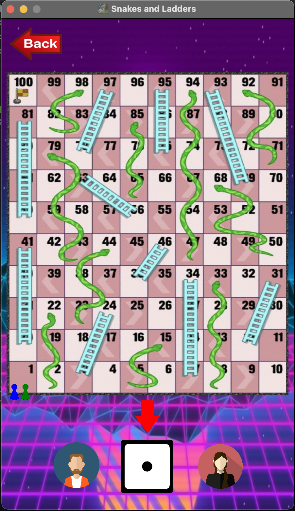

# 🐍🪜 Snakes-and-Ladders-JavaFX 🪜🐍
The classic game, Snakes and Ladders, implemented using principles of OOPS and GUI using Java and JavaFX as the final project for the course Advanced Programming (CSE201)

<br>

## Run the game
After installing all the necessary Libraries run the ```Main``` file located at

    /Snakes-and-Ladders-JavaFX/src/main/java/com/example/demo/Main.java

<br>

## Class Relationships
All the class relationships that have been used in the following Project are being shown graphically in the ```UML Diagram``` located at 

    /Snakes-and-Ladders-JavaFX/UML.pdf

<br>

## Assets
All assets used to make the user interface of the game are located at
    
    /Snakes-and-Ladders-JavaFX/src/main/resources/com/example/demo/


<br>

## Main Menu

<br>


<br>

## Rule Page

<br>


<br>

## Game Screen

<br>



<br>

<p align="center">
Made with ❤️ by Sohum Sikdar & Krishnam Omar    
</p>
